# 基于Springboot的新闻推荐系统

## Springboot-0045


## 技术栈

Springboot mybatisplus vue mysql maven


## 数据库表(9张)


## 功能介绍

```properties
管理员功能有个人中心，用户管理，排行榜管理，新闻管理，我的收藏管理，系统管理等。用户功能可以在首页查看新闻排行榜，新闻信息，并可以注册登录，收藏新闻，对新闻评论。用户注册登录，评论新闻，收藏新闻，查看新闻，搜索新闻。
```


## 图片

### 前台


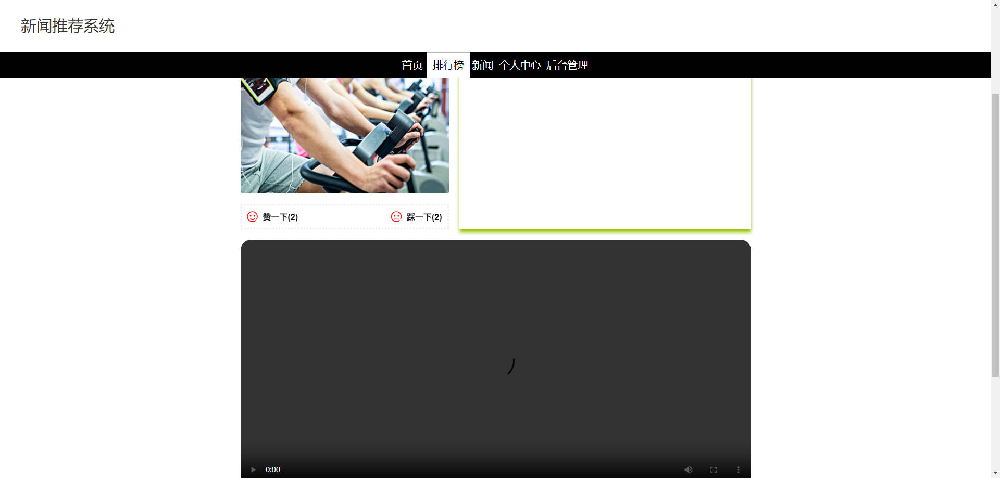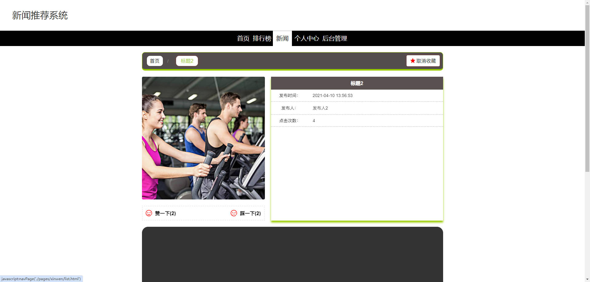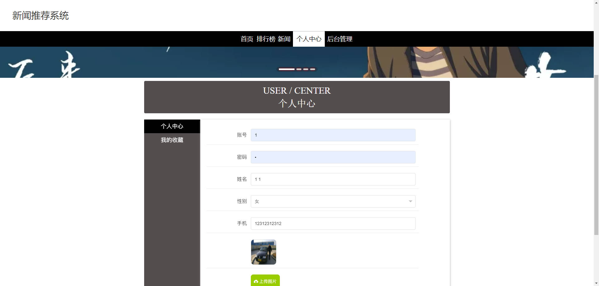

### 后台


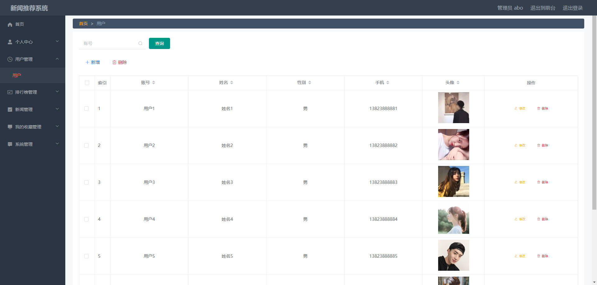

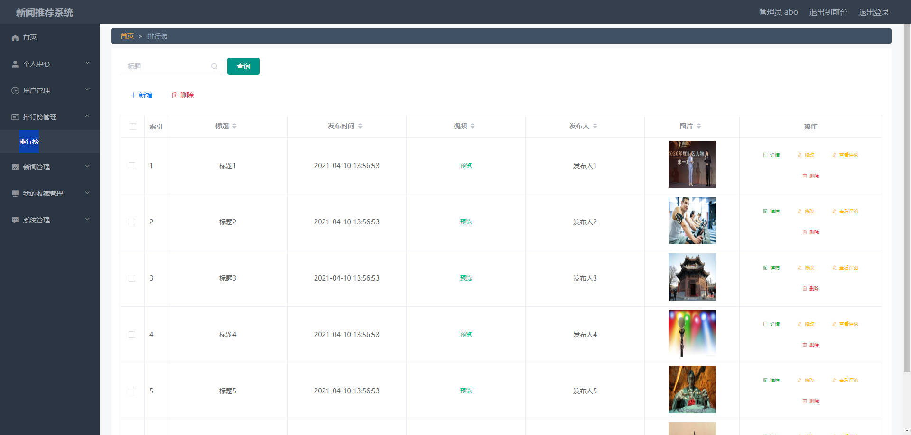

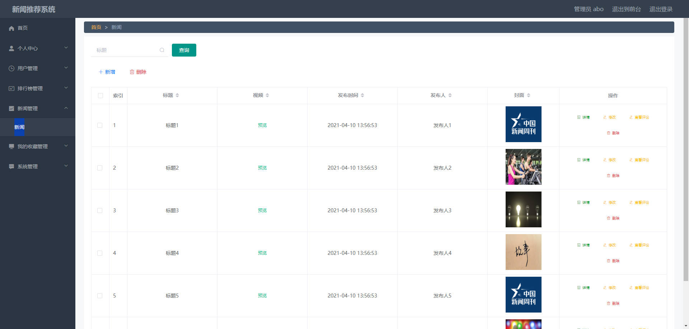

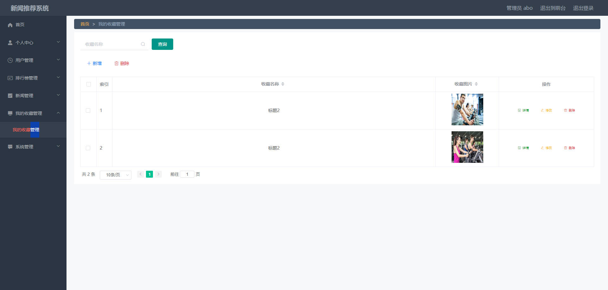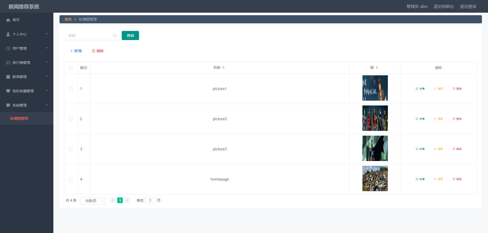


## 访问路径

### 前台

```properties
http://localhost:8080/springboot49j18/front/pages/login/login.html

账号 1
密码 1
```

### 后台

```properties
http://localhost:8080/springboot49j18/admin/dist/index.html#/login

账号 abo
密码 abo
```


## 功能图

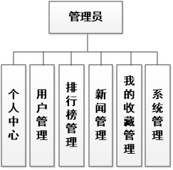

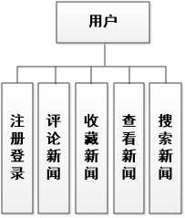

## 文档目录

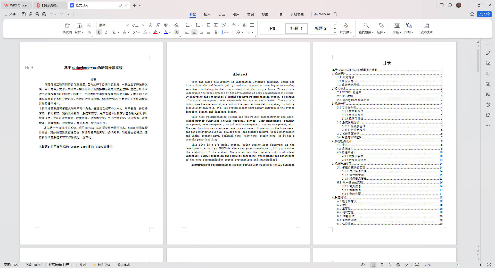


## 打赏或交流


